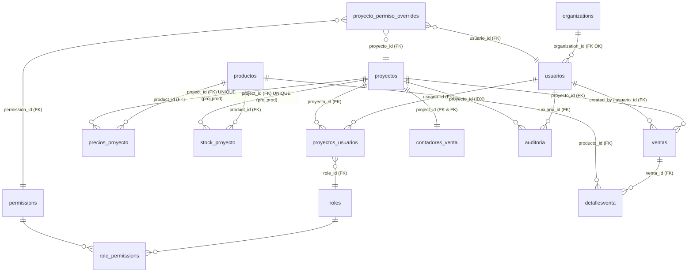

🧠 Fintech Chatbot con Evaluación de Respuestas (LlamaCpp + LangChain + DeepEval)
Este proyecto es un chatbot de atención al cliente para una fintech que responde preguntas sobre tarjetas de débito, crédito y préstamos, usando un modelo de lenguaje local (mistral-7b-instruct en formato .gguf) con LangChain y LlamaCpp.

Además, permite evaluar automáticamente la calidad de las respuestas generadas por el modelo usando un dataset real y la librería DeepEval.

📁 Estructura del proyecto
├── main.py                  # Script principal con menú interactivo
├── metrics.py               # Lógica de evaluación automática (DeepEval)
├── prompt_template.txt      # Prompt instructivo para el modelo
├── eval_dataset.json        # Dataset de evaluación (editable)
├── model/                   # Carpeta donde debes colocar el modelo GGUF
│   └── mistral-7b-instruct-v0.1.Q3_K_S.gguf (NO INCLUIDO)
├── requirements.txt         # Dependencias del proyecto
├── README.md                # Este archivo
⚠️ Modelo no incluido
Por razones de tamaño y licencia, el modelo mistral-7b-instruct-v0.1.Q3_K_S.gguf no está incluido en este repositorio.

🔽 Para descargar el modelo:
Visita https://huggingface.co/TheBloke/Mistral-7B-Instruct-v0.1-GGUF

Descarga el archivo:
mistral-7b-instruct-v0.1.Q3_K_S.gguf

Crea una carpeta model/ dentro del proyecto y coloca el archivo allí.

Resultado esperado:
/model/mistral-7b-instruct-v0.1.Q3_K_S.gguf
🚀 Instalación rápida
# 1. Clona el repositorio
git clone https://github.com/Dev-Brayan-Cardona-7/Prueba_Tecnica_GenAI_itti.git
cd Prueba_Tecnica_GenAI_itti

# 2. Crea entorno virtual
python -m venv venv310
venv310\Scripts\activate  # En Windows

# 3. Instala dependencias
pip install -r requirements.txt
🧠 Uso
python main.py
Opciones del menú:
[1] Usar el chatbot
[2] Generar dataset de evaluación
[3] Evaluar modelo con dataset
📊 Evaluación automática
El sistema usa DeepEval para medir la relevancia de las respuestas del modelo frente a las respuestas esperadas en eval_dataset.json.

Al final muestra un promedio general de desempeño.

🛠 Tecnologías usadas
LangChain

LlamaCpp

DeepEval

Rich Console

link diagrama:Link diagrama: https://mermaid.live/view#pako:eNpNUt1u2jAUfhXrXEyrlKIQEpLmYlIp3YbkTBOUmyW7cPEBrCY2sh1pK-Jh9gC72iPwYnPsonLn7-f8fLaPsFEcoYSdZoc9octGErI2qOuPa9MzLdTNT08t6oW0qLfslXAkD3tmPf-Nruvq_I_3rRrOnptX9Rc0VunBORfnP63aKa88LetHqXvLeBC_otasEygtM95AZ_WMGTR-hpJqI7waqumqXgljsWOGUNy5JoZ8IPffF6G2oq651ShDR-W0z4j8mW1evH4vWVtXSgq3GQ7qQJz_WrFhTr_kJre3n1zakNkDF-stqYfzKmT04GkZYnlAZ9dgFVa-stHZFXhrMOxwWc4TFQ1ZLqMhck8jOJRW9xhBh7pjA4Tj4GvA7rHDBkp35LhlfWsbaOTJlR2Y_KFUd6nUqt_todyy1jjUHzizOBfMvfu7BSVH_aB6aaEcx1PfA8oj_IIyTUd5ViRpOiniu0lRJBH8dqZsMoqnSZakk3icjLM8O0Xw6qfGoyJ3tmycFHFepNM4jwD5cPlV-HH-453-A31PxhM

